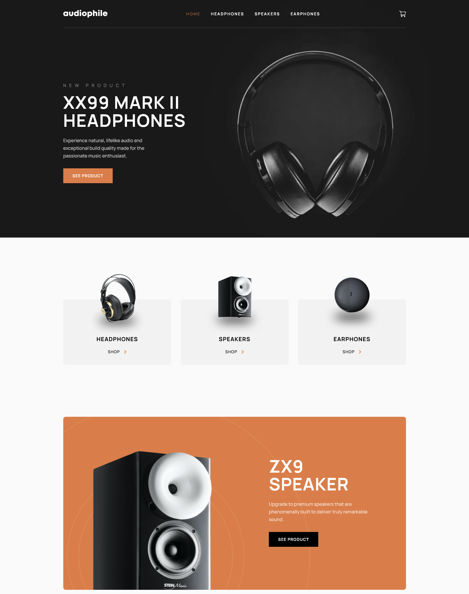

# Frontend Mentor - Audiophile e-commerce website solution

This is a solution to the [Audiophile e-commerce website challenge on Frontend Mentor](https://www.frontendmentor.io/challenges/audiophile-ecommerce-website-C8cuSd_wx). Frontend Mentor challenges help you improve your coding skills by building realistic projects.

## Table of contents

-   [Overview](#overview)
    -   [The challenge](#the-challenge)
    -   [Screenshot](#screenshot)
    -   [Links](#links)
-   [My process](#my-process)
    -   [Built with](#built-with)
    -   [What I learned](#what-i-learned)
    -   [Continued development](#continued-development)
    -   [Useful resources](#useful-resources)
-   [Author](#author)

## Overview

### The challenge

Users should be able to:

-   View the optimal layout for the app depending on their device's screen size
-   See hover states for all interactive elements on the page
-   Add/Remove products from the cart
-   Edit product quantities in the cart
-   Fill in all fields in the checkout
-   Receive form validations if fields are missed or incorrect during checkout
-   See correct checkout totals depending on the products in the cart
    -   Shipping always adds $50 to the order
    -   VAT is calculated as 20% of the product total, excluding shipping
-   See an order confirmation modal after checking out with an order summary
-   **Bonus**: Keep track of what's in the cart, even after refreshing the browser (`localStorage` could be used for this if you're not building out a full-stack app)

### Screenshot

### Links

-   Solution URL: [Add solution URL here](https://your-solution-url.com)
-   Live Site URL: [Add live site URL here](https://your-live-site-url.com)

## My process

### Built with

-   Semantic HTML5 markup
-   Flexbox
-   CSS Grid
-   Mobile-first workflow
-   Vanilla JS

### What I learned

-   How to style the scrollbar on webkit browsers and on Firefox
-   Learned about the 'empty' pseudo-class which allows you to style an element when it has no content. I used this to toggle the visibility of an element.

### Continued development

-   BEM
-   Accessibility

### Useful resources

-   [Javascript Projects - Shopping Cart](https://www.youtube.com/watch?v=90PgFUPIybY) - Coding Addict's tutorial gave me ideas on how to implement one.

## Author

-   Frontend Mentor - [@JeuriMorel](https://www.frontendmentor.io/profile/JeuriMorel)
-   Twitter - [@codeToPerdition](https://twitter.com/codeToPerdition)
